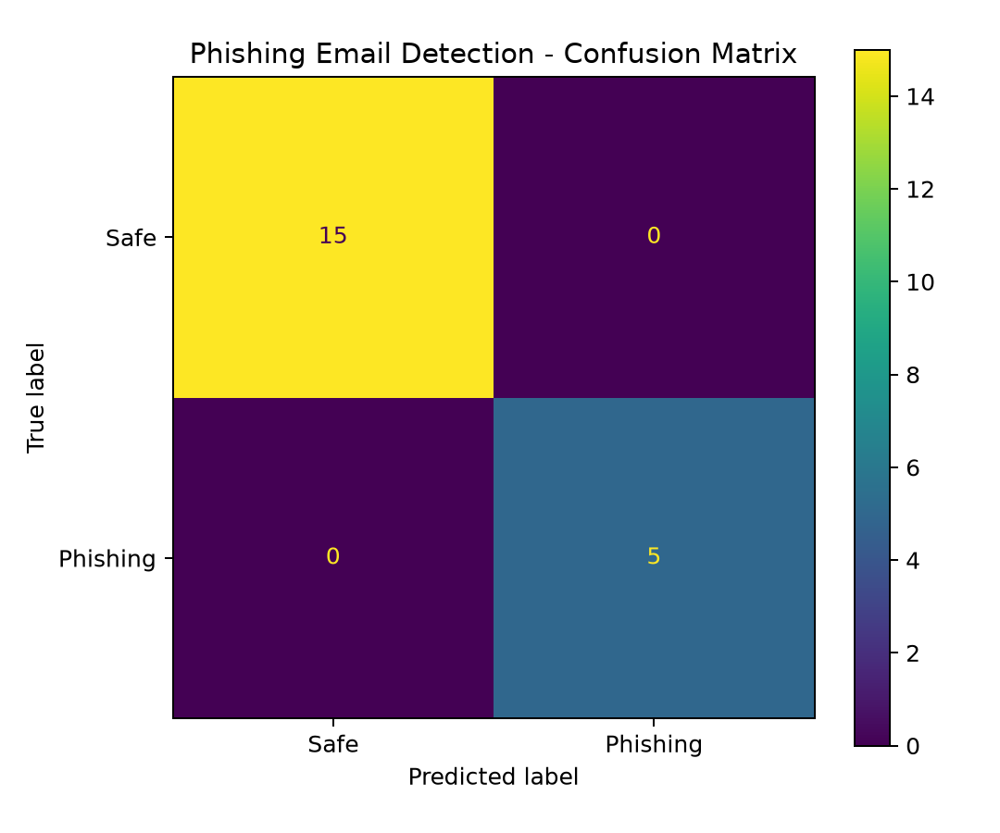
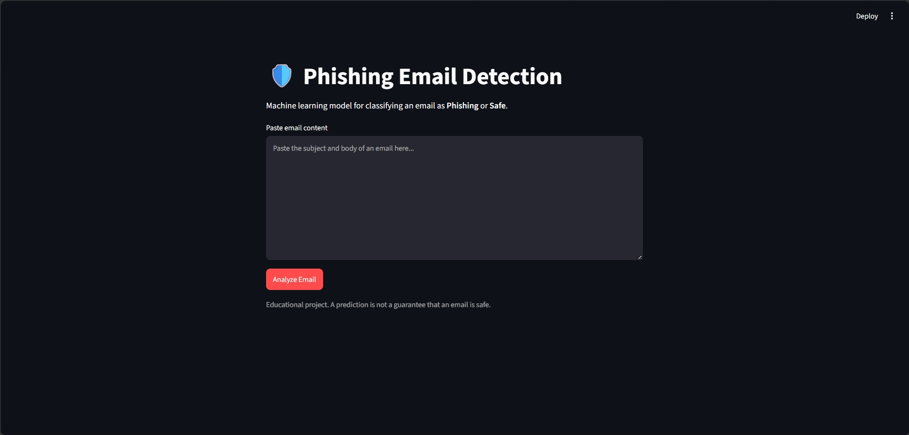

# Thiranex_Phishing_Email_Detection_Project-phishing_email_detection_thiranex

A Machine Learning project that detects whether an email is **Phishing** or **Safe** using TF-IDF, URL security features, phishing keywords, and Logistic Regression.

## 🚀 Features

- Email text analysis using TF-IDF
- URL security feature extraction
- Suspicious URL detection
- IP-address URL detection
- URL shortener detection
- HTTP/HTTPS analysis
- Phishing keyword detection
- Logistic Regression classifier
- Accuracy, Precision, Recall and F1-score
- Confusion matrix
- Streamlit web interface
- Trained model saved using Joblib

## 🧠 How It Works

Email Dataset
↓
Data Cleaning
↓
TF-IDF + URL Features + Keywords
↓
Logistic Regression
↓
Prediction
↓
Phishing / Safe

## 📂 Project Structure

phishing_email_detection_thiranex/
│
├── app.py
├── train_model.py
├── download_dataset.py
├── utils.py
├── requirements.txt
├── README.md
│
├── data/
│   └── sample_emails.csv
│
├── models/
│   └── phishing_model.joblib
│
└── outputs/
    ├── confusion_matrix.png
    └── metrics.txt

## 🛠️ Technologies

- Python
- Pandas
- NumPy
- Scikit-learn
- Matplotlib
- Joblib
- Streamlit

## 📊 Dataset

This project uses the Phishing Validation Emails Dataset from Zenodo.

Dataset:
https://zenodo.org/records/13474746

Citation:

Miltchev, R., Rangelov, D., & Genchev, E. (2024).
Phishing validation emails dataset.
Zenodo.
DOI: 10.5281/zenodo.13474746

## ⚙️ Installation

Clone the repository:

git clone YOUR_GITHUB_REPOSITORY_URL

cd phishing_email_detection_thiranex

Create a virtual environment:

python -m venv .venv

Activate it on Windows:

.venv\Scripts\activate

Install dependencies:

pip install -r requirements.txt

## ▶️ Train the Model

python train_model.py

After training, the following files are created:

models/phishing_model.joblib
outputs/confusion_matrix.png
outputs/metrics.txt

## 🌐 Run the Application

streamlit run app.py

Then open the Streamlit URL shown in the terminal.

Paste an email and click "Analyze Email" to get the prediction.

## 📊 Model Output

### Confusion Matrix

## 📊 Model Output

## 📈 Model Evaluation

The model is evaluated using:

- Accuracy
- Precision
- Recall
- F1-score
- Confusion Matrix

The actual performance values are generated after training and stored in outputs/metrics.txt.

## 🎯 Project Objective

The goal of this project is to build a simple machine-learning system that identifies potentially dangerous phishing emails and helps users recognize suspicious messages.

## 👨‍💻 Project

Thiranex Task 3 – Phishing Email Detection Model

Built using Python and Scikit-learn.
